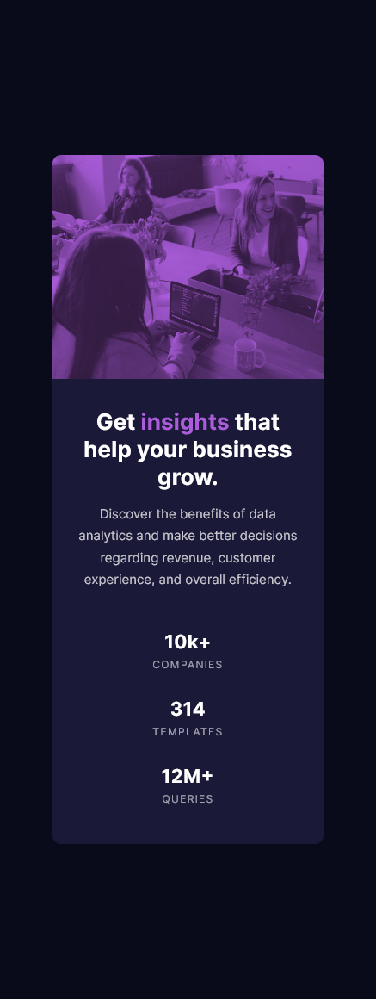

# Frontend Mentor - Stats preview card component solution

This is a solution to the [Stats preview card component challenge on Frontend Mentor](https://www.frontendmentor.io/challenges/stats-preview-card-component-8JqbgoU62). Frontend Mentor challenges help you improve your coding skills by building realistic projects. 

## Table of contents

- [Overview](#overview)
  - [The challenge](#the-challenge)
  - [Screenshot](#screenshot)
  - [Links](#links)
  - [Built with](#built-with)
  - [What I learned](#what-i-learned)
  - [Continued development](#continued-development)
  - [Useful resources](#useful-resources)
- [Author](#author)
- [Acknowledgments](#acknowledgments)

**Note: Delete this note and update the table of contents based on what sections you keep.**

## Overview

### The challenge

Users should be able to:

- View the optimal layout depending on their device's screen size

### Screenshot




### Links

- Solution URL: [Code](https://github.com/slickLink/stats_preview_card_component)
- Live Site URL: [live site](https://stats-preview-component-solution.netlify.app/)

### Built with

- Semantic HTML5 markup
- SASS/SCSS - Css but awesome
- Flexbox
- Mobile-first workflow

### What I learned

-  Tinting an image
To see how you can add code snippets, see below:

```html
<figure>
  
</figure>
```
```scss
// <== shows lines that focus on tinting an image from my solution
figure {
        margin: 0;
        display: flex;
        width: 100%;
        background: $accent; // <==
        border-radius: 10px 10px 0 0;

        img {
            width: inherit;
            opacity: 0.7; // <==
            mix-blend-mode: multiply; // <== optional but a cool find
            border-radius: inherit;
        }
    }
```

### Continued development


### Useful resources

- [Resource 1](https://www.letzcode.in/HtmlCss/4_script.php) - This helped me with tinting an image

## Author

- Frontend Mentor - [@slickLink](https://www.frontendmentor.io/profile/slickLink)

## Acknowledgments

- Youtuber - [PiXimperfect](https://youtu.be/i1D9ijh3_-I)

The normal tinting from [resources](#useful-resources) tinted the image but it didnt look like the design. using:
```css
img {
  mix-blend-mode: multiply;
}
```
seemed to work. The video above taught me about the different blending modes in Photoshop and it translated well to css 😅.

